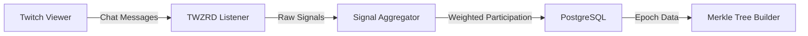
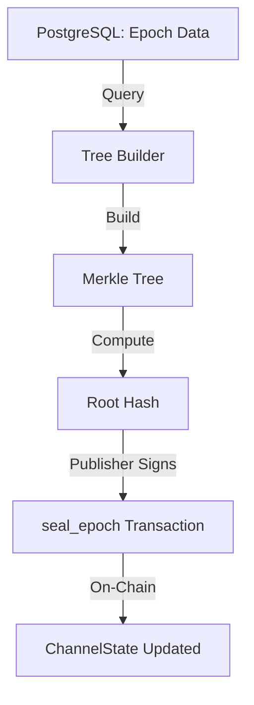
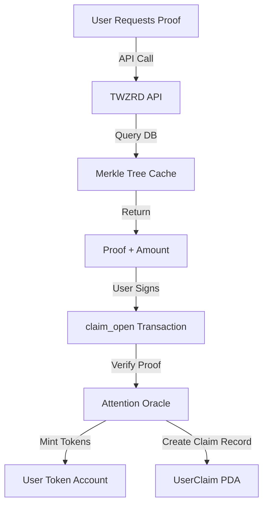
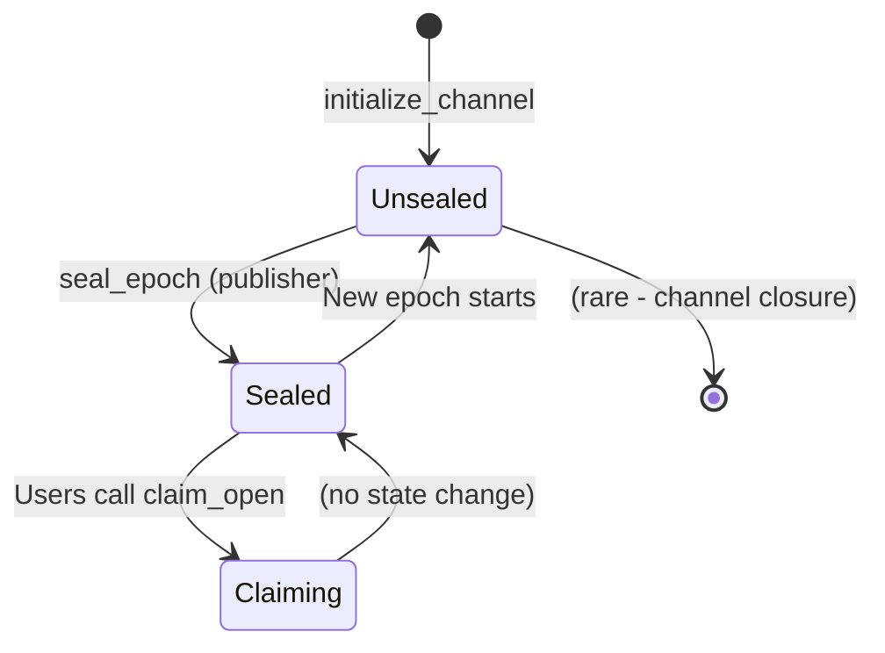

# Architecture Deep Dive - Attention Oracle

**Last Updated:** October 30, 2025
**Program ID:** `4rArjoSZKrYkoE7hkvZNBP2Wpxovr78cfkxBnNwFNPn5`
**Framework:** Anchor v0.30.1

---

## Table of Contents

1. [System Overview](#system-overview)
2. [Data Flow](#data-flow)
3. [Account Architecture](#account-architecture)
4. [PDA Derivation](#pda-derivation)
5. [Epoch Lifecycle](#epoch-lifecycle)
6. [Merkle Proof System](#merkle-proof-system)
7. [Token-2022 Integration](#token-2022-integration)
8. [Ring Buffer Design](#ring-buffer-design)
9. [Security Architecture](#security-architecture)
10. [Performance Considerations](#performance-considerations)

---

## System Overview

The Attention Oracle is a **permissionless claim protocol** that enables users to prove their engagement on off-chain platforms (e.g., Twitch) and claim Token-2022 rewards on Solana.

### Core Principles

1. **Separation of Concerns**
   - **Off-chain:** Signal collection, aggregation, sybil detection (private)
   - **On-chain:** Proof validation, token distribution (public, verifiable)

2. **Cryptographic Verification**
   - Merkle trees provide O(log n) proof size for millions of users
   - Keccak256 hashing for compatibility with EVM tooling
   - Epoch sealing prevents retroactive manipulation

3. **Economic Sustainability**
   - Token-2022 transfer fees fund ongoing operations
   - Fee distribution to protocol treasury (future)
   - Incentive alignment with user rewards

### Architecture Layers

```
┌───────────────────────────────────────────────────────────────┐
│                     APPLICATION LAYER                          │
│  (Web UIs, Mobile Apps, Third-Party Integrations)             │
└─────────────────────────────┬─────────────────────────────────┘
                              │
┌─────────────────────────────▼─────────────────────────────────┐
│                      API LAYER (Off-Chain)                     │
│  - Proof Generation API                                        │
│  - Merkle Tree Query API                                       │
│  - Epoch Status API                                            │
└─────────────────────────────┬─────────────────────────────────┘
                              │
┌─────────────────────────────▼─────────────────────────────────┐
│                 AGGREGATION LAYER (Private)                    │
│  - Twitch IRC Signal Collection                                │
│  - Sybil Detection Heuristics                                  │
│  - Participation Weighting                                     │
│  - Merkle Tree Construction                                    │
└─────────────────────────────┬─────────────────────────────────┘
                              │ Merkle Root + Metadata
┌─────────────────────────────▼─────────────────────────────────┐
│            ATTENTION ORACLE (This Program - Public)            │
│  - Merkle Proof Verification                                   │
│  - Double-Claim Prevention                                     │
│  - Token Distribution via Token-2022                           │
│  - Epoch Management                                            │
└─────────────────────────────┬─────────────────────────────────┘
                              │
┌─────────────────────────────▼─────────────────────────────────┐
│                    SOLANA RUNTIME                              │
│  - Account State Management                                    │
│  - Transaction Execution                                       │
│  - Token Program (Token-2022)                                  │
└───────────────────────────────────────────────────────────────┘
```

---

## Data Flow

### 1. Signal Collection (Off-Chain)



**Process:**
1. Users watch Twitch streams and engage (chat, subscriptions, etc.)
2. TWZRD listener ingests signals from Twitch IRC
3. Signals are weighted (more engagement = higher weight)
4. Sybil detection filters out suspicious accounts
5. Aggregated data is stored in PostgreSQL

### 2. Epoch Sealing (Off-Chain → On-Chain)



**Process:**
1. At epoch boundary (e.g., midnight UTC), aggregator queries final data
2. Merkle tree is built with all qualifying participants
3. Root hash is computed and signed by publisher keypair
4. `seal_epoch` instruction is called on-chain
5. Root hash is stored in `ChannelState` account
6. Epoch is marked as sealed (immutable)

### 3. User Claims (On-Chain)



**Process:**
1. User fetches their merkle proof from TWZRD API
2. Proof includes: `amount`, `proof_path[]`, `leaf_index`
3. User submits `claim_open` transaction with proof
4. Program verifies proof against stored merkle root
5. If valid, tokens are minted to user's account
6. Claim PDA is created to prevent double-claims

---

## Account Architecture

### Core State Accounts

#### 1. ProtocolState (Singleton)

```rust
#[account]
pub struct ProtocolState {
    pub admin: Pubkey,           // 32 bytes - Admin authority
    pub publisher: Pubkey,        // 32 bytes - Merkle root publisher
    pub paused: bool,             // 1 byte - Emergency circuit breaker
    pub require_receipt: bool,    // 1 byte - cNFT receipt requirement
    pub bump: u8,                 // 1 byte - PDA bump seed
    // Total: ~72 bytes + discriminator
}
```

**PDA Seeds:** `["protocol-state"]`

**Purpose:** Global protocol configuration and authority management.

**Access Control:**
- `admin` - Can update admin, pause protocol, set policies
- `publisher` - Can seal epochs and publish merkle roots

#### 2. ChannelState (Per-Channel)

```rust
#[account]
pub struct ChannelState {
    pub channel_id: String,       // Variable - Channel identifier
    pub current_epoch: u64,       // 8 bytes - Current epoch number
    pub merkle_root: [u8; 32],    // 32 bytes - Current epoch root
    pub total_amount: u64,        // 8 bytes - Total claimable tokens
    pub total_claims: u64,        // 8 bytes - Claims this epoch
    pub ring_buffer: [u8; 32],    // 32 bytes - Circular claim history
    pub sealed: bool,             // 1 byte - Epoch sealed flag
    pub bump: u8,                 // 1 byte - PDA bump seed
    // Total: ~120 bytes + variable channel_id
}
```

**PDA Seeds:** `["channel-state", channel_id.as_bytes()]`

**Purpose:** Per-channel epoch state and merkle root storage.

**Key Fields:**
- `merkle_root` - Root hash for current epoch (empty until sealed)
- `sealed` - Prevents overwrites once epoch is finalized
- `ring_buffer` - Compact representation of recent claims

#### 3. UserClaim (Per-User, Per-Channel)

```rust
#[account]
pub struct UserClaim {
    pub user: Pubkey,             // 32 bytes - User public key
    pub channel: Pubkey,          // 32 bytes - ChannelState PDA
    pub epoch: u64,               // 8 bytes - Claimed epoch
    pub amount: u64,              // 8 bytes - Claimed amount
    pub claimed_at: i64,          // 8 bytes - Unix timestamp
    pub bump: u8,                 // 1 byte - PDA bump seed
    // Total: ~88 bytes
}
```

**PDA Seeds:** `["user-claim", user.key(), channel.key()]`

**Purpose:** Prevent double-claims by recording user's claim per channel.

**Important:** Each user can claim ONCE per channel per epoch. If they participate in multiple channels, they get separate claims.

---

## PDA Derivation

### Why PDAs?

**Program Derived Addresses (PDAs)** provide:
1. **Deterministic Addresses** - No need for off-chain storage
2. **Program Signing** - Program can sign transactions on behalf of PDAs
3. **Data Sovereignty** - User can't fake ownership of their claim record

### Derivation Patterns

#### Protocol State
```rust
let (protocol_pda, bump) = Pubkey::find_program_address(
    &[b"protocol-state"],
    &program_id
);
```

**Singleton Pattern:** Only one protocol state exists per program deployment.

#### Channel State
```rust
let (channel_pda, bump) = Pubkey::find_program_address(
    &[b"channel-state", channel_id.as_bytes()],
    &program_id
);
```

**Multi-Instance Pattern:** Each channel (e.g., "twitch:xqc", "twitch:pokimane") gets its own state.

#### User Claim
```rust
let (claim_pda, bump) = Pubkey::find_program_address(
    &[b"user-claim", user.key().as_ref(), channel.key().as_ref()],
    &program_id
);
```

**User-Keyed Pattern:** Ensures each user has exactly one claim record per channel.

### PDA Lookup Optimization

**Client-Side Caching:**
```typescript
// Cache bump seeds to avoid recomputation
const PROTOCOL_BUMP = 255; // Known after first derivation
const channel_pda = PublicKey.findProgramAddressSync(
    [Buffer.from("channel-state"), Buffer.from(channelId)],
    programId
)[0];
```

**On-Chain Bump Storage:**
Every PDA account stores its `bump` seed, enabling faster re-derivation without searching.

---

## Epoch Lifecycle

### States



### 1. Unsealed Epoch

**Characteristics:**
- `sealed = false`
- `merkle_root = [0; 32]` (empty)
- No claims allowed
- Publisher can update root (dangerous - should seal immediately)

**Operations:**
- ❌ Users cannot claim
- ✅ Publisher can call `seal_epoch`
- ✅ Admin can pause protocol

### 2. Sealed Epoch

**Characteristics:**
- `sealed = true`
- `merkle_root != [0; 32]` (published)
- Claims enabled
- Immutable (cannot change root)

**Operations:**
- ✅ Users can claim with valid proofs
- ❌ Publisher cannot overwrite root
- ✅ Admin can still pause protocol (emergency)

### 3. Epoch Transition

**Typical Flow:**
```
Day 1: 00:00 UTC - Epoch 42 sealed with root_hash_42
Day 1: 00:01 UTC - Users start claiming against root_hash_42
Day 2: 00:00 UTC - Epoch 43 sealed with root_hash_43
Day 2: 00:01 UTC - Users now claim against root_hash_43
```

**Important:** Old epochs are **not accessible** on-chain after transition. Users must claim during the epoch window (typically 24 hours).

### Security Invariants

1. **Sealed epochs cannot be modified**
   - `require!(channel.sealed == false)` in `seal_epoch`

2. **Claims require sealed epoch**
   - `require!(channel.sealed == true)` in `claim_open`

3. **One claim per user per channel per epoch**
   - Check if `UserClaim` PDA exists before creating

---

## Merkle Proof System

### Why Merkle Trees?

**Problem:** Storing 1 million user rewards on-chain = expensive.

**Solution:** Store 1 merkle root (32 bytes) on-chain. Each user proves inclusion with O(log n) proof size.

### Tree Construction (Off-Chain)

```typescript
// Pseudo-code for tree building
function buildMerkleTree(participants: Participant[]): MerkleTree {
  // 1. Sort participants deterministically
  const sorted = participants.sort((a, b) =>
    a.pubkey.compare(b.pubkey)
  );

  // 2. Hash each leaf
  const leaves = sorted.map(p =>
    keccak256(encode([p.pubkey, p.amount]))
  );

  // 3. Build tree bottom-up
  return MerkleTree.fromLeaves(leaves, keccak256);
}
```

**Output:**
- `root_hash` → Stored on-chain in `ChannelState`
- `proofs[]` → Served via API to users

### Proof Verification (On-Chain)

```rust
pub fn verify_proof(
    leaf: [u8; 32],          // User's leaf hash
    proof: Vec<[u8; 32]>,    // Proof path
    root: [u8; 32],          // Stored root
) -> bool {
    let mut current = leaf;

    for sibling in proof {
        // Order sibling pairs deterministically
        current = if current <= sibling {
            keccak256(&[current, sibling].concat())
        } else {
            keccak256(&[sibling, current].concat())
        };
    }

    current == root
}
```

**Gas Cost:** ~5,000 compute units per proof level (32 levels max = ~160K CU).

### Proof Structure

```json
{
  "user": "87d5WsriU5DiGPSFvojQJH525qsHNiHCP4m2Qa19ufdy",
  "amount": 1000000000,
  "proof": [
    "0xabc123...",  // Level 0 - Sibling leaf
    "0xdef456...",  // Level 1 - Uncle
    "0x789abc...",  // Level 2 - Great-uncle
    // ... up to 32 levels for 4B+ users
  ],
  "leaf_index": 42  // Position in tree (for validation)
}
```

---

## Token-2022 Integration

### Why Token-2022?

**Advantages over SPL Token:**
1. **Transfer Fees** - Protocol revenue without external logic
2. **Transfer Hooks** - Extensible behavior (future composability)
3. **Metadata Extensions** - Rich token info on-chain
4. **Backwards Compatible** - Existing wallets work

### Fee Structure

```rust
// Example: 1% transfer fee
pub const TRANSFER_FEE_BASIS_POINTS: u16 = 100; // 1%
pub const MAX_FEE: u64 = 100_000_000; // 0.1 CCM max fee
```

**Flow:**
```
User claims 1000 CCM
├─ 990 CCM → User's token account
└─ 10 CCM → Fee accumulator account
```

**Fee Distribution (Future):**
- Treasury funding for operations
- Staking rewards for protocol participants
- Buyback and burn mechanisms

### Transfer Hook Extensibility

**Current:** No hooks enabled (minimal attack surface).

**Future:** Hooks could enable:
- Dynamic fee adjustments based on demand
- Auto-staking upon claim
- Cross-protocol integrations (e.g., Jupiter swaps)

### Mint Authority Model

```
Mint Authority: Protocol State PDA (program-controlled)
├─ Advantage: No centralized mint key
├─ Disadvantage: Cannot disable minting later
└─ Mitigation: Circuit breaker (pause) mechanism
```

---

## Ring Buffer Design

### Problem: Unbounded State Growth

**Naive Approach:**
```rust
pub struct ChannelState {
    pub claims: Vec<UserClaim>, // ❌ Grows forever
}
```

**Issue:** After 1 million claims, account size = 88MB (unaffordable).

### Solution: Ring Buffer

```rust
pub struct ChannelState {
    pub ring_buffer: [u8; 32],  // Fixed 32-byte buffer
    pub current_epoch: u64,
}
```

**How It Works:**
1. Each claim sets 1 bit in the 256-bit ring buffer
2. Bit position = `hash(user_pubkey) % 256`
3. Provides probabilistic double-claim detection

**Limitations:**
- **False Positives:** ~0.4% chance after 1K claims (birthday paradox)
- **Not Cryptographically Sound:** Use `UserClaim` PDA as source of truth

**Why Still Use It?**
- Cheap first-pass check (1 byte read)
- Catches accidental double-submissions
- Complements PDA existence checks

### Ring Buffer Update

```rust
pub fn mark_claim(ring_buffer: &mut [u8; 32], user: &Pubkey) {
    let hash = keccak256(user.as_ref());
    let bit_index = (hash[0] as usize) % 256; // Use first byte
    let byte_index = bit_index / 8;
    let bit_offset = bit_index % 8;

    ring_buffer[byte_index] |= 1 << bit_offset;
}
```

---

## Security Architecture

### Authorization Model

```
┌─────────────┐
│   Admin     │ (Cold wallet, post-hackathon: Ledger)
└──────┬──────┘
       │ Can:
       ├─ update_admin_open (transfer authority)
       ├─ set_paused_open (emergency pause)
       └─ set_policy_open (require_receipt flag)

┌─────────────┐
│  Publisher  │ (Hot wallet, automated)
└──────┬──────┘
       │ Can:
       ├─ seal_epoch (publish merkle roots)
       ├─ update_publisher_open (rotate key)
       └─ initialize_channel (create channels)

┌─────────────┐
│    Users    │ (Anyone)
└──────┬──────┘
       │ Can:
       └─ claim_open (with valid proof)
```

### Defense in Depth

**Layer 1: Account Validation**
```rust
#[derive(Accounts)]
pub struct ClaimOpen<'info> {
    #[account(seeds = [b"protocol-state"], bump = protocol.bump)]
    pub protocol: Account<'info, ProtocolState>,

    #[account(
        mut,
        seeds = [b"channel-state", channel.channel_id.as_bytes()],
        bump = channel.bump
    )]
    pub channel: Account<'info, ChannelState>,

    // Prevents fake claim PDAs
    #[account(
        init,
        payer = user,
        space = 88,
        seeds = [b"user-claim", user.key().as_ref(), channel.key().as_ref()],
        bump
    )]
    pub user_claim: Account<'info, UserClaim>,
}
```

**Layer 2: State Checks**
```rust
require!(!protocol.paused, ErrorCode::ProtocolPaused);
require!(channel.sealed, ErrorCode::EpochNotSealed);
```

**Layer 3: Cryptographic Validation**
```rust
require!(
    verify_merkle_proof(leaf, proof, channel.merkle_root),
    ErrorCode::InvalidProof
);
```

### Attack Vectors & Mitigations

| Attack | Mitigation |
|--------|-----------|
| **Double-claim** | `UserClaim` PDA prevents account recreation |
| **Invalid proof** | Merkle verification rejects tampered proofs |
| **Replay attack** | Epoch-bound proofs (root changes each epoch) |
| **Frontrunning** | No MEV opportunity (claim amount fixed in proof) |
| **Admin key compromise** | Post-hackathon: Ledger migration, 2-step transfer |
| **Publisher key compromise** | Admin can rotate publisher immediately |
| **Program upgrade exploit** | Upgrade authority will be multisig post-launch |

---

## Performance Considerations

### Compute Budget

**Typical Transaction:**
```
┌────────────────────┬──────────┐
│ Operation          │ CU Cost  │
├────────────────────┼──────────┤
│ Account validation │ ~10K     │
│ Merkle proof (20)  │ ~100K    │
│ Token mint         │ ~30K     │
│ PDA creation       │ ~20K     │
│ Events             │ ~5K      │
├────────────────────┼──────────┤
│ **Total**          │ ~165K CU │
└────────────────────┴──────────┘
```

**Well within 200K CU default budget.** No priority fees required for normal operation.

### Account Size Optimization

**Zero-Copy Deserialization:**
```rust
#[account(zero_copy)]
pub struct LargeState {
    // Avoids copying large structs into memory
}
```

**Used for:** Channel state with embedded ring buffers.

### RPC Efficiency

**Minimize Lookups:**
```typescript
// ❌ Bad: Multiple RPC calls
const protocol = await program.account.protocolState.fetch(protocolPda);
const channel = await program.account.channelState.fetch(channelPda);

// ✅ Good: Single getMultipleAccounts call
const [protocol, channel] = await connection.getMultipleAccountsInfo([
  protocolPda,
  channelPda
]);
```

---

## Future Enhancements

### Planned Improvements

1. **Two-Step Admin Transfer**
   - Prevents accidental authority loss
   - Pending acceptance pattern

2. **Multi-Signature Support**
   - Squads protocol integration
   - M-of-N authority for critical operations

3. **Fee Distribution**
   - Accumulated fees → Treasury
   - Automated distribution logic

4. **Passport Oracle Integration**
   - Verified identity tier system
   - Higher rewards for authenticated users

5. **Cross-Chain Bridge**
   - Wormhole integration for EVM chains
   - Unified rewards across ecosystems

---

## References

- [Anchor Framework Documentation](https://www.anchor-lang.com/)
- [Token-2022 Extensions Guide](https://spl.solana.com/token-2022)
- [Solana Program Runtime](https://docs.solana.com/developing/programming-model/overview)
- [Merkle Trees (Wikipedia)](https://en.wikipedia.org/wiki/Merkle_tree)

---

*For integration examples, see [INTEGRATION.md](INTEGRATION.md)*
*For security details, see [SECURITY.md](SECURITY.md)*
*For API reference, see [API.md](API.md)*
