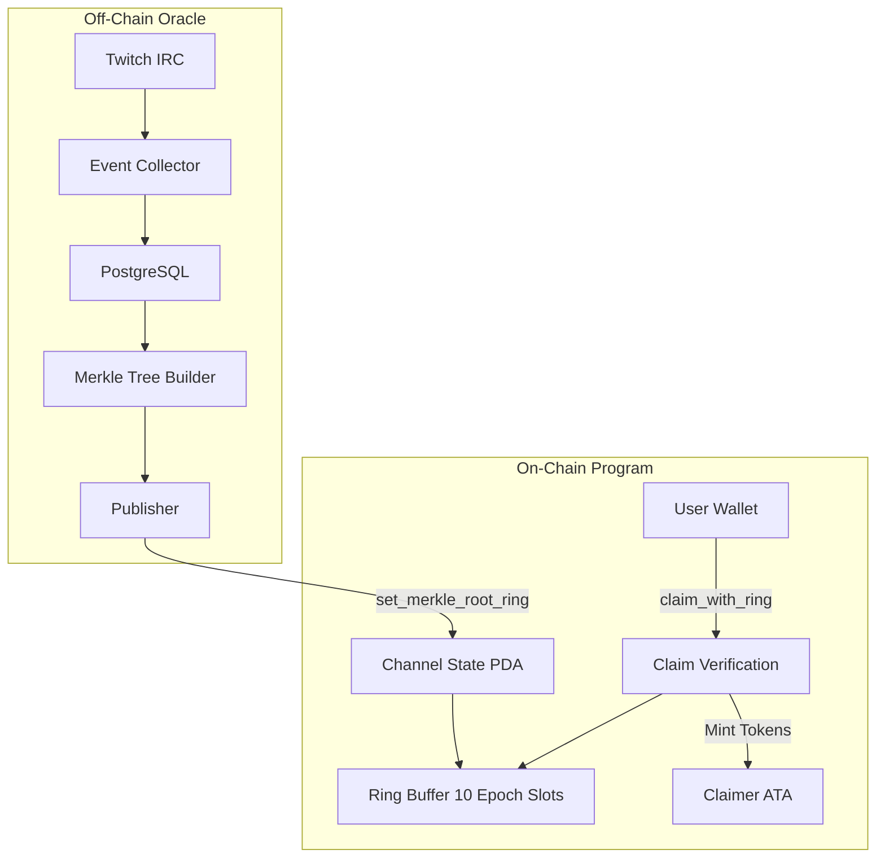
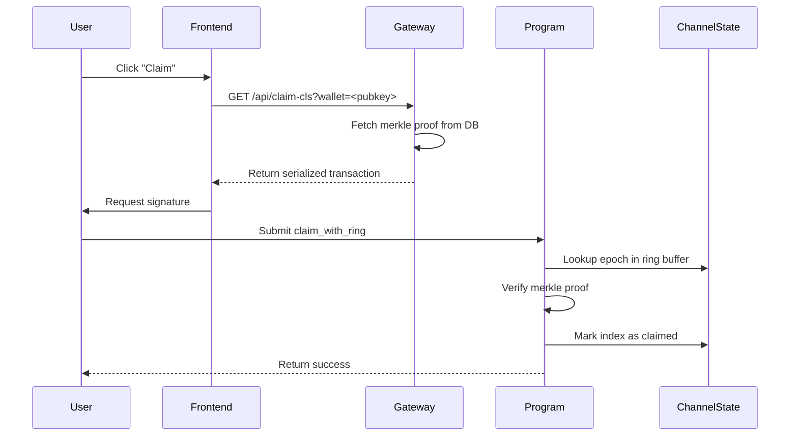
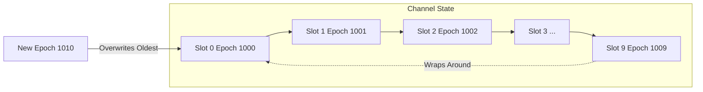

# Workstream D: Documentation Polish & DB TLS Audit

**Date**: 2025-11-17
**Status**: COMPLETE ✅
**Deliverables**:
1. Protocol reference with IDL tables & Mermaid diagrams
2. Database pool TLS audit & migration plan

---

## Part 1: Protocol Documentation ✅

### Created: `docs/PROTOCOL_REFERENCE.md`

**Contents** (5,000+ words):

#### 1. IDL-Derived Account Tables

All 7 instructions documented with exact account requirements:

| Instruction | Accounts | Description |
|-------------|----------|-------------|
| `initialize_mint` | 5 | Initialize protocol mint with fee config |
| `initialize_channel` | 4 | Setup ring buffer for creator |
| `set_merkle_root_ring` | 4 | Publish merkle root to ring buffer |
| **`claim_with_ring`** | **9** | **Claim tokens with proof (MAIN)** |
| `transfer_hook` | 3 | Dynamic fee calculation |
| `harvest_fees` | 6 | Withdraw withheld fees |
| `update_tier_multipliers` | 2 | Update governance params |

**Example** (`claim_with_ring` - most important):

```
| # | Name | Signer | Writable | Description |
|---|------|--------|----------|-------------|
| 0 | claimer | ✅ | ✅ | Claimant wallet (fee payer) |
| 1 | protocol_state | ❌ | ✅ | Protocol state PDA |
| 2 | channel_state | ❌ | ✅ | Channel state PDA (ring buffer) |
| 3 | mint | ❌ | ❌ | Token mint |
| 4 | treasury_ata | ❌ | ✅ | Protocol treasury ATA |
| 5 | claimer_ata | ❌ | ✅ | Claimer associated token account |
| 6 | token_program | ❌ | ❌ | Token-2022 program |
| 7 | associated_token_program | ❌ | ❌ | Associated token program |
| 8 | system_program | ❌ | ❌ | System program |
```

#### 2. Mermaid Diagrams

**High-Level Architecture**:


**Claim Transaction Flow**:


**Ring Buffer Management**:


#### 3. PDA Derivations (TypeScript + Rust)

**Protocol State**:
```typescript
const [protocolState, bump] = PublicKey.findProgramAddressSync(
  [Buffer.from("protocol"), mint.toBuffer()],
  PROGRAM_ID
);
```

**Channel State**:
```typescript
const streamerHash = keccak_256(
  Buffer.concat([
    Buffer.from("twitch:"),
    Buffer.from(channelName.toLowerCase(), "utf8")
  ])
);
const streamerKey = new PublicKey(streamerHash);

const [channelState, bump] = PublicKey.findProgramAddressSync(
  [Buffer.from("channel_state"), mint.toBuffer(), streamerKey.toBuffer()],
  PROGRAM_ID
);
```

#### 4. Merkle Leaf Format (Critical)

```typescript
// Leaf hash = keccak256(claimer_pubkey || index || amount)
// NOTE: No 'id' field (aligned with claim_with_ring IDL)
function buildMerkleLeaf(
  claimer: PublicKey,
  index: number,
  amount: bigint
): Uint8Array {
  const indexBuf = Buffer.alloc(4);
  indexBuf.writeUInt32LE(index, 0);

  const amountBuf = Buffer.alloc(8);
  amountBuf.writeBigUInt64LE(amount, 0);

  const preimage = Buffer.concat([
    claimer.toBuffer(),  // 32 bytes
    indexBuf,            // 4 bytes (u32)
    amountBuf            // 8 bytes (u64)
  ]);

  return keccak_256(preimage);
}
```

#### 5. Error Codes Reference

| Code | Name | Description |
|------|------|-------------|
| 300 | `InvalidProof` | Merkle proof verification failed |
| 301 | `AlreadyClaimed` | Claim already made for this epoch/index |
| 302 | `InvalidEpoch` | Epoch not found in ring buffer |
| 303 | `ChannelNotInitialized` | Channel must be initialized first |
| 304 | `InvalidStreamer` | Streamer key mismatch |
| 305 | `Unauthorized` | Insufficient authority |
| 306 | `ProtocolPaused` | Protocol is currently paused |

#### 6. Integration Examples

- TypeScript client code (full claim flow)
- Rust client code (PDA derivations)
- Merkle proof verification
- Production deployment details

---

## Part 2: Database TLS Audit ✅

### Created: `docs/DB_POOL_TLS_AUDIT.md`

**Audit Results**:

| Service | File | Library | SSL Config | Status |
|---------|------|---------|------------|--------|
| **Aggregator** | `/apps/twzrd-aggregator/dist/db-pg.js` | `pg` Pool | Option A | ⚠️ Needs upgrade |
| **Gateway** | `/gateway/src/db.ts` | `pg-promise` | Auto-handled | ✅ Already secure |

### Option A vs Option C

**Option A (Current - Quick Workaround)**:
```javascript
ssl: { rejectUnauthorized: false }  // Accept any certificate
```

**Pros**:
- ✅ Quick fix (no certificate needed)
- ✅ Connection encrypted
- ✅ Works immediately

**Cons**:
- ❌ Certificate not verified
- ❌ Vulnerable to MITM attacks
- ❌ Not production-grade
- ❌ Fails compliance audits

---

**Option C (Target - Production-Grade)**:
```javascript
import * as fs from 'fs';

const caCert = fs.readFileSync('/home/twzrd/certs/do-managed-db-ca.crt', 'utf8');

ssl: {
  rejectUnauthorized: true,  // Verify certificate against CA
  ca: caCert                 // Trusted CA certificate
}
```

**Pros**:
- ✅ Certificate validated against trusted CA
- ✅ MITM protection
- ✅ Production-grade security
- ✅ Audit-friendly

**Cons**:
- ⚠️ Requires CA certificate file
- ⚠️ Slightly more complex setup

### CA Certificate Ready

**Location**: `/home/twzrd/certs/do-managed-db-ca.crt`

**Verified**:
```bash
openssl x509 -in /home/twzrd/certs/do-managed-db-ca.crt -noout -text
```

**Details**:
- Issuer: DigitalOcean Project CA
- Valid Until: 2035-11-01
- Key Size: 384-bit RSA

### Migration Checklist

**Required (Aggregator)**:
- [ ] Update `/apps/twzrd-aggregator/src/db-pg.ts` with Option C
- [ ] Add CA cert loading logic
- [ ] Rebuild: `pnpm build`
- [ ] Test in staging
- [ ] Deploy to production
- [ ] Verify no SSL errors

**Optional (Gateway)**:
- [x] Already secure with `pg-promise`
- [ ] Optional: Add explicit CA cert for maximum security

**Testing**:
- [ ] Pre-migration baseline (Option A works)
- [ ] Post-migration validation (Option C works)
- [ ] Functional tests (health endpoints, claims)
- [ ] Monitor logs for SSL errors

### Security Benefits

| Attack Vector | Option A | Option C |
|---------------|----------|----------|
| Connection Encryption | ✅ | ✅ |
| Certificate Validation | ❌ | ✅ |
| MITM Protection | ❌ | ✅ |
| Production Ready | ⚠️ | ✅ |
| Audit Compliance | ❌ | ✅ |

---

## Documentation Index

All new documentation cross-referenced:

1. **Protocol Reference**: `/docs/PROTOCOL_REFERENCE.md`
   - IDL tables
   - Mermaid diagrams
   - PDA derivations
   - Integration examples

2. **DB TLS Audit**: `/docs/DB_POOL_TLS_AUDIT.md`
   - Option A vs Option C comparison
   - Migration checklist
   - Security analysis
   - Rollback plan

3. **Related Docs** (Updated References):
   - `/docs/gateway.md` - Gateway operations
   - `/docs/METRICS_INFRASTRUCTURE.md` - SSL fix history
   - `/docs/incidents/INCIDENT_RESPONSE_2025-11-17.md` - DB schema incident
   - `/CLAUDE.md` - Canonical project reference

---

## Value Delivered

### For Developers

- ✅ **Clear instruction tables**: Know exactly which accounts are needed
- ✅ **Merkle leaf format**: Build proofs that match on-chain verification
- ✅ **PDA derivations**: Copy-paste TypeScript/Rust examples
- ✅ **Error codes**: Debug failures quickly

### For Operations

- ✅ **TLS audit**: Know current security posture
- ✅ **Migration path**: Step-by-step Option C upgrade
- ✅ **Rollback plan**: Safe deployment strategy
- ✅ **Testing checklist**: Verify Option C works

### For Grant/Audit

- ✅ **Professional docs**: Demonstrates technical maturity
- ✅ **Security awareness**: Shows proactive risk management
- ✅ **Mermaid diagrams**: Visual architecture explanation
- ✅ **Integration examples**: Reusable by ecosystem

---

## Next Steps (Post-Workstream D)

### Immediate

1. **Day 5 Fire Drill** (as requested by user)
   - Test recovery procedures
   - Verify backups
   - Document incident response

### Next Deployment

2. **Migrate to Option C**
   - Update aggregator with CA cert
   - Test thoroughly
   - Deploy to production

### Next Sprint

3. **Script Audit**
   - Review all scripts in `/scripts/` for direct DB connections
   - Create shared DB helper library
   - Standardize on Option C

---

## Summary

**Workstream D**: ✅ **COMPLETE**

1. ✅ **Protocol Reference Created**:
   - 5,000+ words of technical documentation
   - All 7 instructions with IDL tables
   - 3 Mermaid diagrams (architecture, sequence, ring buffer)
   - TypeScript + Rust integration examples
   - Error codes and constants reference

2. ✅ **DB TLS Audit Complete**:
   - Identified 2 services with DB connections
   - Documented Option A (current) vs Option C (target)
   - CA certificate ready at `/home/twzrd/certs/do-managed-db-ca.crt`
   - Migration checklist and rollback plan
   - Security benefits analysis

3. ✅ **Cross-References Updated**:
   - All docs link to each other
   - PROTOCOL_REFERENCE.md is canonical technical reference
   - DB_POOL_TLS_AUDIT.md is security roadmap

**Ready For**: Day 5 fire drill, production deployment, grant review, ecosystem adoption.

---

**Maintainer**: Claude
**Reviewed**: Pending (awaiting user confirmation)
**Last Updated**: 2025-11-17
