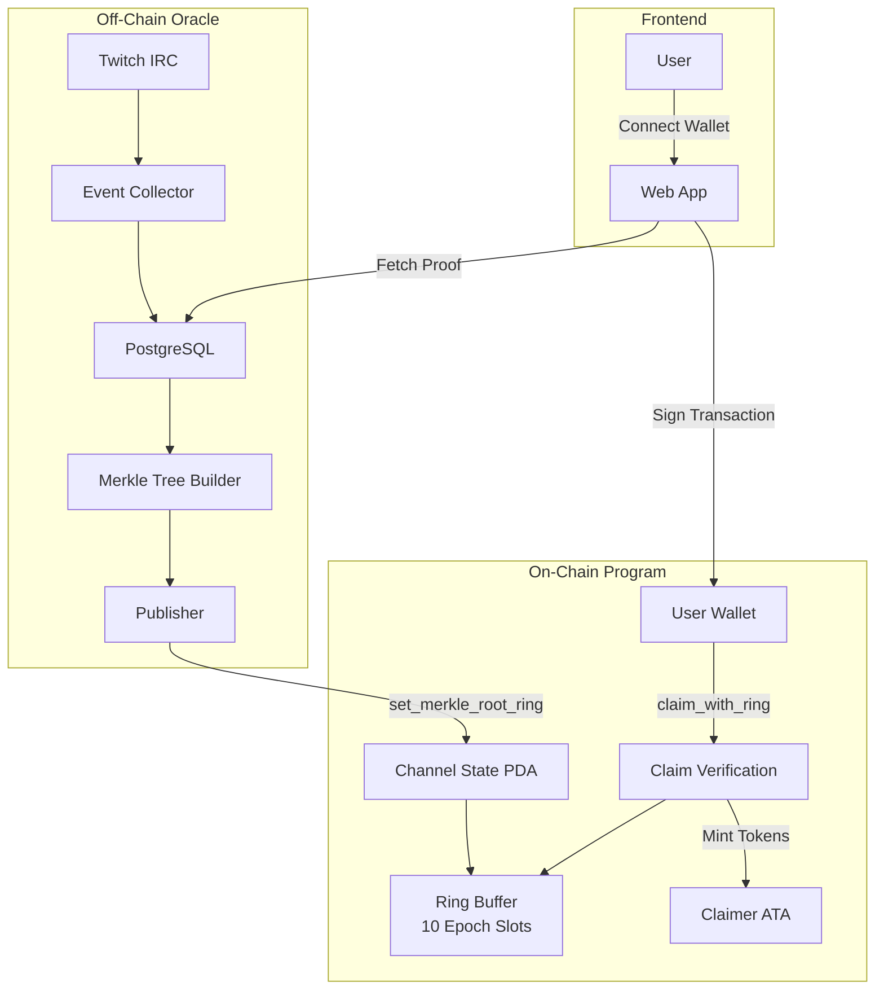
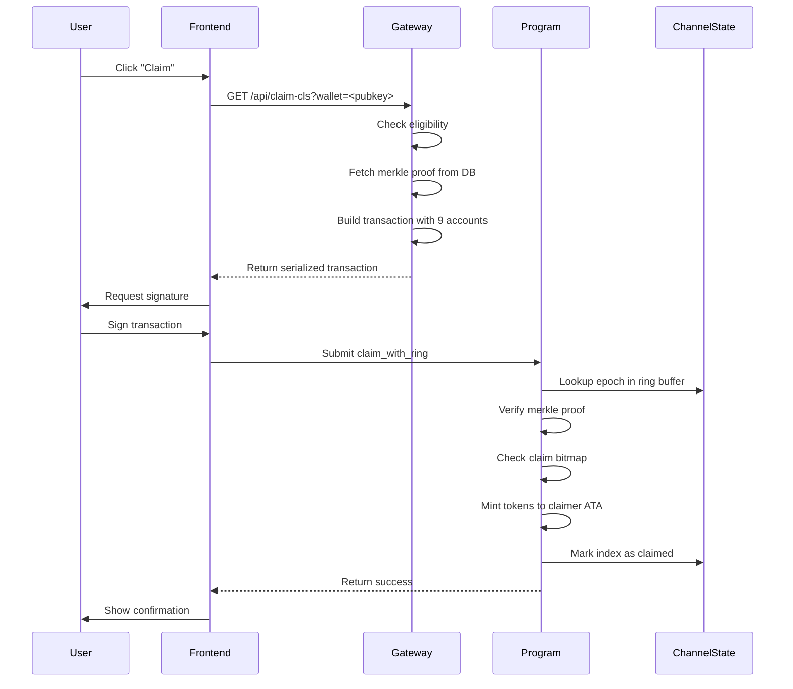
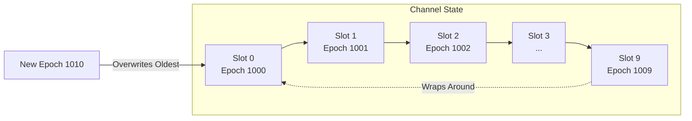

# Token-2022 Protocol Reference

**Program ID**: `GnGzNdsQMxMpJfMeqnkGPsvHm8kwaDidiKjNU2dCVZop`
**IDL Version**: 0.1.0
**Last Updated**: 2025-11-17

---

## Table of Contents

1. [Overview](#overview)
2. [Instructions](#instructions)
3. [Account Structure](#account-structure)
4. [PDA Derivations](#pda-derivations)
5. [Claim Flow Diagrams](#claim-flow-diagrams)
6. [Error Codes](#error-codes)

---

## Overview

The Attention Oracle protocol enables verifiable token distribution for creator economies on Solana. It uses:

- **Token-2022** (SPL Token) for native mint/transfer support
- **Ring Buffers** for bounded epoch storage (10 slots per channel)
- **Merkle Proofs** for gas-efficient claim verification
- **Channel State** for per-creator epoch management

### Key Concepts

- **Channel**: A creator's namespace (e.g., Twitch streamer)
- **Epoch**: Time-bounded participation window (typically 1 hour)
- **Ring Buffer**: Circular array of 10 epoch slots per channel
- **Streamer Key**: Derived from `keccak256("twitch:" || channel_name)`

---

## IDL Instruction Summary

IDL: `token_2022` v0.1.0 (source: apps/claim-ui/idl/token-2022.json)

| Instruction | Accounts | Args |
|---|---:|---:|
| `initialize_mint` | 5 | 1 |
| `initialize_channel` | 4 | 1 |
| `set_merkle_root_ring` | 4 | 4 |
| `claim_with_ring` | 9 | 5 |
| `transfer_hook` | 3 | 1 |
| `harvest_fees` | 6 | 0 |
| `update_tier_multipliers` | 2 | 1 |

For full account/arg details, see Appendix A: IDL Tables.

## Instructions

### 1. `initialize_mint`

Initialize a new protocol mint with fee configuration.

#### Accounts (5 total)

| # | Name | Signer | Writable | Description |
|---|------|--------|----------|-------------|
| 0 | `payer` | ✅ | ✅ | Account paying for initialization |
| 1 | `mint` | ✅ | ✅ | Token-2022 mint account |
| 2 | `protocol_state` | ❌ | ✅ | Protocol PDA: `[b"protocol", mint]` |
| 3 | `token_program` | ❌ | ❌ | Token-2022 program |
| 4 | `system_program` | ❌ | ❌ | System program |

#### Args

```rust
pub struct InitializeMintArgs {
    pub fee_bps: u16,  // Transfer fee basis points (e.g., 100 = 1%)
}
```

---

### 2. `initialize_channel`

Initialize ring buffer for a channel (one-time setup per creator).

#### Accounts (4 total)

| # | Name | Signer | Writable | Description |
|---|------|--------|----------|-------------|
| 0 | `payer` | ✅ | ✅ | Account paying for initialization |
| 1 | `protocol_state` | ❌ | ❌ | Protocol state PDA |
| 2 | `channel_state` | ❌ | ✅ | Channel state PDA: `[b"channel_state", mint, streamer_key]` |
| 3 | `system_program` | ❌ | ❌ | System program |

#### Args

```rust
pub struct InitializeChannelArgs {
    pub streamer_key: Pubkey,  // Derived from keccak256("twitch:" || channel_name)
}
```

---

### 3. `set_merkle_root_ring`

Set merkle root for an epoch in the ring buffer.

#### Accounts (4 total)

| # | Name | Signer | Writable | Description |
|---|------|--------|----------|-------------|
| 0 | `update_authority` | ✅ | ❌ | Admin or publisher authority |
| 1 | `protocol_state` | ❌ | ✅ | Protocol state PDA |
| 2 | `channel_state` | ❌ | ✅ | Channel state PDA |
| 3 | `system_program` | ❌ | ❌ | System program |

#### Args

```rust
pub struct SetMerkleRootRingArgs {
    pub root: [u8; 32],        // Merkle root hash
    pub epoch: u64,            // Epoch number (UNIX timestamp)
    pub claim_count: u16,      // Number of claims in this epoch
    pub streamer_key: Pubkey,  // Streamer identifier
}
```

---

### 4. `claim_with_ring` ⭐

**Most Important**: Claim tokens using merkle proof against ring buffer state.

#### Accounts (9 total)

| # | Name | Signer | Writable | Description |
|---|------|--------|----------|-------------|
| 0 | `claimer` | ✅ | ✅ | Claimant wallet (fee payer) |
| 1 | `protocol_state` | ❌ | ✅ | Protocol state PDA |
| 2 | `channel_state` | ❌ | ✅ | Channel state PDA (ring buffer) |
| 3 | `mint` | ❌ | ❌ | Token mint |
| 4 | `treasury_ata` | ❌ | ✅ | Protocol treasury ATA |
| 5 | `claimer_ata` | ❌ | ✅ | Claimer associated token account |
| 6 | `token_program` | ❌ | ❌ | Token-2022 program |
| 7 | `associated_token_program` | ❌ | ❌ | Associated token program |
| 8 | `system_program` | ❌ | ❌ | System program |

#### Args

```rust
pub struct ClaimWithRingArgs {
    pub epoch: u64,               // Epoch being claimed
    pub index: u32,               // Index in merkle tree
    pub amount: u64,              // Amount of tokens to claim
    pub proof: Vec<[u8; 32]>,     // Merkle proof nodes
    pub streamer_key: Pubkey,     // Streamer identifier
}
```

#### Merkle Leaf Format

```rust
// Leaf hash = keccak256(claimer_pubkey || index || amount)
// NOTE: No 'id' field (simpler than legacy claim_open)
let leaf_preimage = [
    claimer.to_bytes(),           // 32 bytes
    index.to_le_bytes(),          // 4 bytes (u32)
    amount.to_le_bytes(),         // 8 bytes (u64)
].concat();

let leaf = keccak256(leaf_preimage);
```

#### On-Chain Verification

1. Lookup epoch in ring buffer (channel_state)
2. Verify merkle proof against stored root
3. Check claim bitmap (index not already claimed)
4. Mint tokens to claimer_ata
5. Mark index as claimed in bitmap

---

### 5. `transfer_hook`

Transfer hook for dynamic fee calculation based on passport tier.

#### Accounts (3 total)

| # | Name | Signer | Writable | Description |
|---|------|--------|----------|-------------|
| 0 | `source` | ❌ | ✅ | Source token account |
| 1 | `mint` | ❌ | ❌ | Token mint |
| 2 | `destination` | ❌ | ✅ | Destination token account |

#### Args

```rust
pub struct TransferHookArgs {
    pub token_amount: u64,  // Amount being transferred
}
```

---

### 6. `harvest_fees`

Harvest accumulated transfer fees from mint (admin-only).

#### Accounts (6 total)

| # | Name | Signer | Writable | Description |
|---|------|--------|----------|-------------|
| 0 | `admin` | ✅ | ❌ | Protocol admin |
| 1 | `protocol_state` | ❌ | ✅ | Protocol state PDA |
| 2 | `mint` | ❌ | ✅ | Token mint |
| 3 | `treasury_ata` | ❌ | ✅ | Treasury ATA for fee collection |
| 4 | `token_program` | ❌ | ❌ | Token-2022 program |
| 5 | `system_program` | ❌ | ❌ | System program |

#### Args

None (harvests all withheld fees from mint extension).

---

### 7. `update_tier_multipliers`

Update passport tier fee multipliers (governance).

#### Accounts (2 total)

| # | Name | Signer | Writable | Description |
|---|------|--------|----------|-------------|
| 0 | `admin` | ✅ | ❌ | Protocol admin |
| 1 | `protocol_state` | ❌ | ✅ | Protocol state PDA |

#### Args

```rust
pub struct UpdateTierMultipliersArgs {
    pub multipliers: [u8; 6],  // Fee multipliers for tiers 0-5 (as basis points %)
}
```

---

## Account Structure

### `ProtocolState`

**PDA Seeds**: `[b"protocol", mint]`

```rust
pub struct ProtocolState {
    pub version: u8,           // Protocol version
    pub bump: u8,              // PDA bump seed
    pub mint: Pubkey,          // Token mint
    pub admin: Pubkey,         // Protocol admin authority
    pub publisher: Pubkey,     // Publisher authority for merkle roots
    pub treasury: Pubkey,      // Treasury wallet for fee collection
    pub paused: bool,          // Protocol pause flag
    pub fee_config: FeeConfig, // Dynamic fee configuration
}
```

### `ChannelState`

**PDA Seeds**: `[b"channel_state", mint, streamer_key]`

```rust
pub struct ChannelState {
    pub version: u8,              // Account version
    pub bump: u8,                 // PDA bump
    pub mint: Pubkey,             // Token mint
    pub streamer: Pubkey,         // Streamer identifier (keccak hash)
    pub latest_epoch: u64,        // Most recent epoch set
    pub slots: [EpochSlot; 10],   // Ring buffer: 10 slots for epochs
}
```

### `EpochSlot`

Single epoch slot in ring buffer.

```rust
pub struct EpochSlot {
    pub epoch: u64,                // Epoch number (UNIX timestamp)
    pub root: [u8; 32],            // Merkle root hash
    pub claim_count: u16,          // Number of claims in this epoch
    pub claimed_bitmap: [u8; 128], // Bitmap tracking claimed indices (1024 claims max)
}
```

### `FeeConfig`

Transfer fee configuration with tier multipliers.

```rust
pub struct FeeConfig {
    pub treasury_fee_bps: u16,     // Fixed treasury fee (e.g., 5 = 0.05%)
    pub creator_fee_bps: u16,      // Base creator fee (e.g., 5 = 0.05%)
    pub tier_multipliers: [u8; 6], // Multipliers for passport tiers 0-5
}
```

---

## PDA Derivations

### Protocol State

```typescript
const [protocolState, bump] = PublicKey.findProgramAddressSync(
  [Buffer.from("protocol"), mint.toBuffer()],
  PROGRAM_ID
);
```

### Channel State

```typescript
// Streamer key from channel name
const streamerHash = keccak_256(
  Buffer.concat([
    Buffer.from("twitch:"),
    Buffer.from(channelName.toLowerCase(), "utf8")
  ])
);
const streamerKey = new PublicKey(streamerHash);

// Channel state PDA
const [channelState, bump] = PublicKey.findProgramAddressSync(
  [Buffer.from("channel_state"), mint.toBuffer(), streamerKey.toBuffer()],
  PROGRAM_ID
);
```

### Treasury ATA

```typescript
import { getAssociatedTokenAddressSync } from '@solana/spl-token';

const treasuryAta = getAssociatedTokenAddressSync(
  mint,
  protocolState,
  true, // allowOwnerOffCurve = true (PDA owner)
  TOKEN_2022_PROGRAM_ID
);
```

### Claimer ATA

```typescript
const claimerAta = getAssociatedTokenAddressSync(
  mint,
  claimerWallet,
  false, // allowOwnerOffCurve = false (user wallet)
  TOKEN_2022_PROGRAM_ID
);
```

---

## Claim Flow Diagrams

### High-Level Architecture



### Claim Transaction Flow



### Ring Buffer Management



**Properties**:
- Each slot stores: epoch number, merkle root, claim count, claimed bitmap
- Circular array of 10 slots
- New epochs overwrite oldest slot
- Bounded storage: O(1) space per channel

---

## Error Codes

| Code | Name | Description |
|------|------|-------------|
| 300 | `InvalidProof` | Merkle proof verification failed |
| 301 | `AlreadyClaimed` | Claim already made for this epoch/index |
| 302 | `InvalidEpoch` | Epoch not found in ring buffer |
| 303 | `ChannelNotInitialized` | Channel must be initialized first |
| 304 | `InvalidStreamer` | Streamer key mismatch |
| 305 | `Unauthorized` | Insufficient authority to perform this action |
| 306 | `ProtocolPaused` | Protocol is currently paused |

---

## Program Constants

```rust
// Maximum claims per epoch slot (bitmap supports 1024)
pub const MAX_CLAIMS_PER_SLOT: u16 = 1024;

// Ring buffer size (number of epoch slots per channel)
pub const RING_BUFFER_SIZE: usize = 10;

// Passport tiers (for fee multipliers)
pub const TIER_COUNT: usize = 6;

// Fee basis points (100 = 1%)
pub const BASE_TREASURY_FEE_BPS: u16 = 5;  // 0.05%
pub const BASE_CREATOR_FEE_BPS: u16 = 5;   // 0.05%
```

---

## Integration Examples

### TypeScript Client

```typescript
import { Connection, PublicKey, Transaction } from '@solana/web3.js';
import { keccak_256 } from '@noble/hashes/sha3';

const PROGRAM_ID = new PublicKey('GnGzNdsQMxMpJfMeqnkGPsvHm8kwaDidiKjNU2dCVZop');
const MINT = new PublicKey('<MINT_PUBKEY>');

// Derive streamer key
function deriveStreamerKey(channelName: string): PublicKey {
  const hash = keccak_256(
    Buffer.concat([
      Buffer.from('twitch:'),
      Buffer.from(channelName.toLowerCase(), 'utf8')
    ])
  );
  return new PublicKey(hash);
}

// Derive channel state PDA
function deriveChannelState(mint: PublicKey, streamerKey: PublicKey): [PublicKey, number] {
  return PublicKey.findProgramAddressSync(
    [Buffer.from('channel_state'), mint.toBuffer(), streamerKey.toBuffer()],
    PROGRAM_ID
  );
}

// Build merkle leaf
function buildMerkleLeaf(
  claimer: PublicKey,
  index: number,
  amount: bigint
): Uint8Array {
  const indexBuf = Buffer.alloc(4);
  indexBuf.writeUInt32LE(index, 0);

  const amountBuf = Buffer.alloc(8);
  amountBuf.writeBigUInt64LE(amount, 0);

  const preimage = Buffer.concat([
    claimer.toBuffer(),
    indexBuf,
    amountBuf
  ]);

  return keccak_256(preimage);
}

// Verify merkle proof
function verifyMerkleProof(
  leaf: Uint8Array,
  proof: Uint8Array[],
  root: Uint8Array
): boolean {
  let hash = Buffer.from(leaf);

  for (const node of proof) {
    const [a, b] = Buffer.compare(hash, Buffer.from(node)) <= 0
      ? [hash, Buffer.from(node)]
      : [Buffer.from(node), hash];

    hash = Buffer.from(keccak_256(Buffer.concat([a, b])));
  }

  return hash.equals(Buffer.from(root));
}
```

### Rust Client

```rust
use anchor_lang::prelude::*;
use solana_sdk::keccak;

// Derive streamer key
pub fn derive_streamer_key(channel_name: &str) -> Pubkey {
    let preimage = format!("twitch:{}", channel_name.to_lowercase());
    let hash = keccak::hash(preimage.as_bytes());
    Pubkey::new_from_array(hash.0)
}

// Derive channel state PDA
pub fn derive_channel_state(
    program_id: &Pubkey,
    mint: &Pubkey,
    streamer_key: &Pubkey,
) -> (Pubkey, u8) {
    Pubkey::find_program_address(
        &[
            b"channel_state",
            mint.as_ref(),
            streamer_key.as_ref(),
        ],
        program_id,
    )
}

// Build merkle leaf
pub fn build_merkle_leaf(
    claimer: &Pubkey,
    index: u32,
    amount: u64,
) -> [u8; 32] {
    let mut preimage = Vec::new();
    preimage.extend_from_slice(claimer.as_ref());
    preimage.extend_from_slice(&index.to_le_bytes());
    preimage.extend_from_slice(&amount.to_le_bytes());

    keccak::hash(&preimage).0
}
```

---

## Production Deployment

### Mainnet Program

- **Program ID**: `GnGzNdsQMxMpJfMeqnkGPsvHm8kwaDidiKjNU2dCVZop`
- **Deployed**: 2025-10-18
- **Binary Size**: 654 KB (optimized SBF)
- **Solscan**: [View on Explorer](https://solscan.io/account/GnGzNdsQMxMpJfMeqnkGPsvHm8kwaDidiKjNU2dCVZop)

### Security

- **Audit Status**: Self-audited (grant-funded audit pending)
- **Security Policy**: [SECURITY.md](https://github.com/twzrd-sol/attention-oracle-program/blob/main/SECURITY.md)
- **Contact**: security@twzrd.com
- **Bug Bounty**: TBD (post-grant)

### Rate Limits

- **Claims per epoch per user**: 1 (enforced by claimed bitmap)
- **Claims per epoch per channel**: 1024 (bitmap size limit)
- **Ring buffer size**: 10 epochs (circular overwrite)

---

## References

- **IDL**: `/apps/claim-ui/idl/token-2022.json`
- **Source Code**: [GitHub](https://github.com/twzrd-sol/attention-oracle-program)
- **Canonical Docs**: `/home/twzrd/milo-token/CLAUDE.md`
- **Gateway API**: `/docs/gateway.md`
- **Metrics**: `/docs/METRICS_INFRASTRUCTURE.md`

---

**Last Updated**: 2025-11-17
**Maintainer**: twzrd
**Version**: 0.1.0 (Production)


## Appendix A: IDL Tables

### Accounts and Args (from IDL)


#### `initialize_mint`

Accounts (5)

| # | Name | Signer | Writable |
|---:|------|:-----:|:-------:|
| 0 | `payer` | ✅ | ✅ |
| 1 | `mint` | ✅ | ✅ |
| 2 | `protocol_state` | ❌ | ✅ |
| 3 | `token_program` | ❌ | ❌ |
| 4 | `system_program` | ❌ | ❌ |

Args (1)

| Name | Type |
|------|------|
| `fee_bps` | ``u16`` |


## Appendix A: IDL Tables

### Accounts and Args (from IDL)


#### `initialize_channel`

Accounts (4)

| # | Name | Signer | Writable |
|---:|------|:-----:|:-------:|
| 0 | `payer` | ✅ | ✅ |
| 1 | `protocol_state` | ❌ | ❌ |
| 2 | `channel_state` | ❌ | ✅ |
| 3 | `system_program` | ❌ | ❌ |

Args (1)

| Name | Type |
|------|------|
| `streamer_key` | ``publicKey`` |


## Appendix A: IDL Tables

### Accounts and Args (from IDL)


#### `set_merkle_root_ring`

Accounts (4)

| # | Name | Signer | Writable |
|---:|------|:-----:|:-------:|
| 0 | `update_authority` | ✅ | ❌ |
| 1 | `protocol_state` | ❌ | ✅ |
| 2 | `channel_state` | ❌ | ✅ |
| 3 | `system_program` | ❌ | ❌ |

Args (4)

| Name | Type |
|------|------|
| `root` | ``{"array":["u8",32]}`` |
| `epoch` | ``u64`` |
| `claim_count` | ``u16`` |
| `streamer_key` | ``publicKey`` |


## Appendix A: IDL Tables

### Accounts and Args (from IDL)


#### `claim_with_ring`

Accounts (9)

| # | Name | Signer | Writable |
|---:|------|:-----:|:-------:|
| 0 | `claimer` | ✅ | ✅ |
| 1 | `protocol_state` | ❌ | ✅ |
| 2 | `channel_state` | ❌ | ✅ |
| 3 | `mint` | ❌ | ❌ |
| 4 | `treasury_ata` | ❌ | ✅ |
| 5 | `claimer_ata` | ❌ | ✅ |
| 6 | `token_program` | ❌ | ❌ |
| 7 | `associated_token_program` | ❌ | ❌ |
| 8 | `system_program` | ❌ | ❌ |

Args (5)

| Name | Type |
|------|------|
| `epoch` | ``u64`` |
| `index` | ``u32`` |
| `amount` | ``u64`` |
| `proof` | ``{"vec":{"array":["u8",32]}}`` |
| `streamer_key` | ``publicKey`` |


## Appendix A: IDL Tables

### Accounts and Args (from IDL)


#### `claim_open`

Accounts (13)

| # | Name | Signer | Writable |
|---:|------|:-----:|:-------:|
| 0 | `claimer` | ✅ | ✅ |
| 1 | `protocol_state` | ❌ | ✅ |
| 2 | `epoch_state` | ❌ | ✅ |
| 3 | `mint` | ❌ | ❌ |
| 4 | `treasury_ata` | ❌ | ✅ |
| 5 | `claimer_ata` | ❌ | ✅ |
| 6 | `token_program` | ❌ | ❌ |
| 7 | `associated_token_program` | ❌ | ❌ |
| 8 | `system_program` | ❌ | ❌ |
| 9 | `fee_config` | ❌ | ❌ |
| 10 | `channel_state` | ❌ | ❌ |
| 11 | `passport_state` | ❌ | ✅ |
| 12 | `creator_pool_ata` | ❌ | ✅ |

Args (7)

| Name | Type |
|------|------|
| `index` | ``u32`` |
| `amount` | ``u64`` |
| `id` | ``string`` |
| `proof` | ``{"vec":{"array":["u8",32]}}`` |
| `channel` | ``{"option":"string"}`` |
| `twzrd_epoch` | ``{"option":"u64"}`` |
| `receipt_proof` | ``{"option":{"defined":"CnftReceiptProof"}}`` |


## Appendix A: IDL Tables

### Accounts and Args (from IDL)


#### `transfer_hook`

Accounts (3)

| # | Name | Signer | Writable |
|---:|------|:-----:|:-------:|
| 0 | `source` | ❌ | ✅ |
| 1 | `mint` | ❌ | ❌ |
| 2 | `destination` | ❌ | ✅ |

Args (1)

| Name | Type |
|------|------|
| `token_amount` | ``u64`` |


## Appendix A: IDL Tables

### Accounts and Args (from IDL)


#### `harvest_fees`

Accounts (6)

| # | Name | Signer | Writable |
|---:|------|:-----:|:-------:|
| 0 | `admin` | ✅ | ❌ |
| 1 | `protocol_state` | ❌ | ✅ |
| 2 | `mint` | ❌ | ✅ |
| 3 | `treasury_ata` | ❌ | ✅ |
| 4 | `token_program` | ❌ | ❌ |
| 5 | `system_program` | ❌ | ❌ |

Args (0)

(none)


## Appendix A: IDL Tables

### Accounts and Args (from IDL)


#### `update_tier_multipliers`

Accounts (2)

| # | Name | Signer | Writable |
|---:|------|:-----:|:-------:|
| 0 | `admin` | ✅ | ❌ |
| 1 | `protocol_state` | ❌ | ✅ |

Args (1)

| Name | Type |
|------|------|
| `multipliers` | ``{"array":["u8",6]}`` |
